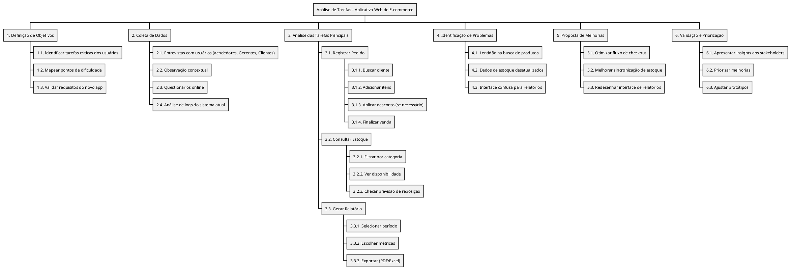
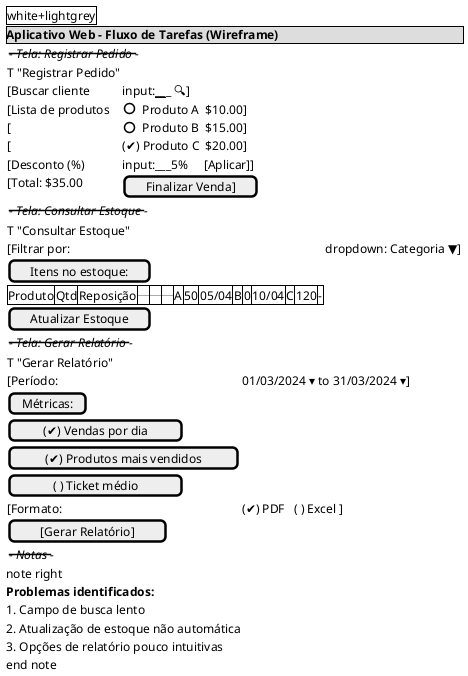

# 06 - **Análise de Tarefas**  

**Contexto:**  

Uma empresa de e-commerce está desenvolvendo um **novo aplicativo web** para facilitar a gestão de pedidos, estoque e atendimento ao cliente. A equipe de UX/UI precisa realizar uma **análise de tarefas** para entender como os usuários (vendedores, gerentes e clientes) interagem com o sistema atual e identificar oportunidades de melhoria.  

---

## **1. Objetivo da Análise de Tarefas**  

- Mapear as principais tarefas realizadas pelos usuários no sistema atual.  
- Identificar pontos de dificuldade, redundâncias e oportunidades de otimização.  
- Validar se o novo aplicativo atenderá às necessidades dos usuários.  

---

## **2. Público-Alvo (Personas)**  

| Perfil          | Tarefas Principais                     |  
|-----------------|----------------------------------------|  
| **Vendedor**    | Registrar pedidos, consultar estoque   |  
| **Gerente**     | Aprovar descontos, gerar relatórios    |  
| **Cliente**     | Acompanhar pedido, solicitar suporte   |  

---

## **3. Métodos de Coleta de Dados**  

- **Entrevistas com usuários:** Perguntar sobre fluxos de trabalho e desafios.  
- **Observação contextual:** Acompanhar usuários em seu ambiente real.  
- **Questionários online:** Coletar feedback quantitativo.  
- **Análise de logs:** Verificar padrões de uso no sistema atual.  

---

## **4. Principais Tarefas a Serem Analisadas**  

| Tarefa                  | Passos Identificados                     | Possíveis Problemas              |  
|-------------------------|------------------------------------------|----------------------------------|  
| **Registrar pedido**    | 1. Buscar cliente → 2. Adicionar itens → 3. Aplicar desconto (se necessário) → 4. Finalizar venda | Lentidão na busca de produtos |  
| **Consultar estoque**   | 1. Filtrar por categoria → 2. Ver disponibilidade → 3. Checar previsão de reposição | Dados desatualizados |  
| **Gerar relatório**     | 1. Selecionar período → 2. Escolher métricas → 3. Exportar PDF/Excel | Interface confusa |  

---

## **5. Ferramentas Utilizadas**  

- **Mapeamento de fluxo:** **Figma** ou **Miro** para diagramas.  
- **Gravação de sessões:** **Hotjar** ou **Lookback** para análise de interações.  
- **Organização de dados:** **Excel** ou **Airtable** para catalogar tarefas.  

---

## **6. Resultados Esperados**  

- **Lista de tarefas críticas** a serem otimizadas no novo app.  
- **Protótipo de fluxos** aprimorados (ex.: checkout em menos etapas).  
- **Relatório de insights** com recomendações para a equipe de desenvolvimento.  

---

## **7. Próximos Passos**  

1. Validar os resultados com stakeholders.  
2. Priorizar melhorias com base na análise.  
3. Aplicar mudanças no design do novo aplicativo.  

---

**Conclusão:**  
A análise de tarefas ajudará a garantir que o novo aplicativo web seja **intuitivo, eficiente e alinhado** com as necessidades reais dos usuários.  

---

Aqui está um diagrama **WBS (Work Breakdown Structure)** em **PlantUML** para representar as tarefas da análise de tarefas do aplicativo web:

### **Visualização do Diagrama:**

O diagrama organiza as tarefas em uma estrutura hierárquica, mostrando:

1. **Objetivos** da análise.
2. **Métodos de coleta de dados**.
3. **Tarefas principais** com subtarefas detalhadas.
4. **Problemas identificados**.
5. **Propostas de melhorias**.
6. **Validação final** com stakeholders.

### **Como Usar:**

- Copie o código e cole em um editor PlantUML (como [PlantText](https://www.planttext.com/) ou integrado a ferramentas como VS Code).
- O diagrama será gerado automaticamente.

---

Aqui está um protótipo de **fluxo de tarefas em formato wireframe** usando **PlantUML Salt**, simulando telas básicas do aplicativo web de e-commerce:

---

### **Características do Protótipo:**

1. **Registrar Pedido**:
   - Campo de busca com ícone de lupa 🔍
   - Lista de produtos selecionáveis (checkboxes)
   - Seção para aplicar desconto
   - Botão de ação principal

2. **Consultar Estoque**:
   - Dropdown para filtro
   - Tabela de dados simulada
   - Botão para atualização manual (problema identificado)

3. **Gerar Relatório**:
   - Seletores de período
   - Checkboxes para métricas
   - Opções de formato de exportação

4. **Anotações**:
   - Destaque dos 3 principais problemas de UX

---

### **Como Visualizar:**

1. Copie o código para qualquer editor PlantUML (como [PlantText](https://www.planttext.com/))
2. O resultado será um wireframe estático com:
   - Elementos interativos simulados (inputs, dropdowns, checkboxes)
   - Organização visual por telas
   - Anotações contextuais

### **Variações Possíveis:**

- Para **fluxos navegacionais**, adicione setas entre telas:

- Para **detalhar componentes**, use notação `+`:

```plantuml
  @startsalt
  {
    + Botão Primário [Confirmar]
    + Botão Secundário [Cancelar]
  }
  @endsalt
```

Este formato é ideal para **discussões iniciais** com a equipe, permitindo ajustes rápidos antes de protótipos high-fidelity.

---
