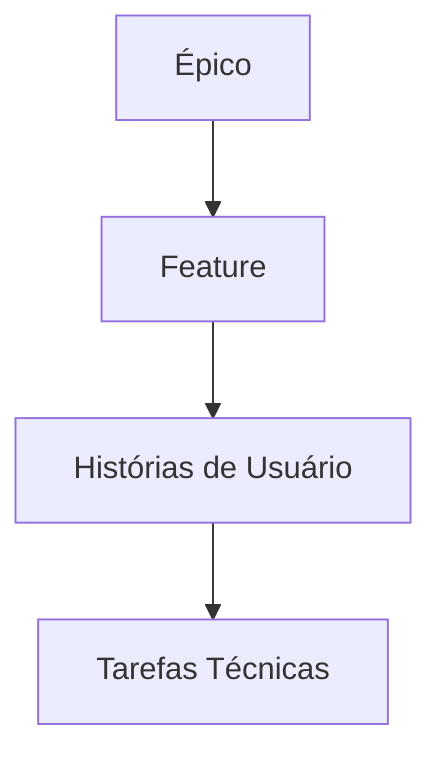

# 09 - **Histórias de usuário** 

A partir do cenário, análise de tarefas e protótipo, podemos levantar as seguintes **histórias de usuário** utilizando o formato padrão ("Como [persona], quero [ação] para [benefício]"):

---

## **Personas**

### **1. Histórias para Vendedores**  

**US01** - Como **vendedor**, quero **buscar clientes rapidamente pelo nome ou CPF** para agilizar o atendimento.  
*(Critério de Aceitação: Resultados em <2 segundos, com sugestão ao digitar)*  

**US02** - Como **vendedor**, quero **aplicar descontos personalizados** para fidelizar clientes.  
*(Critério de Aceitação: Campo com validação de limite por perfil de usuário)*  

**US03** - Como **vendedor**, quero **ver o estoque em tempo real** durante a venda para evitar prometer produtos indisponíveis.  
*(Critério de Aceitação: Indicador visual "ESGOTADO" se quantidade = 0)*  

### **2. Histórias para Gerentes**  

**US04** - Como **gerente**, quero **aprovar descontos acima de 10%** para manter a margem de lucro.  
*(Critério de Aceitação: Notificação push para aprovação em 2º nível)*  

**US05** - Como **gerente**, quero **exportar relatórios de vendas por período** para análise mensal.  
*(Critério de Aceitação: Opções de PDF/Excel com gráficos embutidos)*  

**US06** - Como **gerente**, quero **receber alertas de estoque crítico** para evitar rupturas.  
*(Critério de Aceitação: Notificação quando estoque <5 unidades)*  

### **3. Histórias para Clientes**  

**US07** - Como **cliente**, quero **rastrear meu pedido em tempo real** para planejar meu dia.  
*(Critério de Aceitação: Status com etapas "Preparação/Entrega/Entregue")*  

**US08** - Como **cliente**, quero **solicitar trocas via chat** para resolver problemas sem ligar.  
*(Critério de Aceitação: Botão "Abrir Chamado" no histórico de pedidos)*  

### **4. Histórias Técnicas (Derivadas dos Problemas Identificados)**  

**US09** - Como **sistema**, preciso **sincronizar o estoque com o PDV a cada 5 minutos** para evitar vendas de itens indisponíveis.  

**US10** - Como **equipe de UX**, queremos **redesenhar o fluxo de relatórios** para reduzir cliques desnecessários.  
*(Critério de Aceitação: Teste A/B com redução de 50% no tempo de geração)*  

### **Priorização (MoSCoW)**  

| Categoria | Histórias                          |  
|-----------|------------------------------------|  
| **Must**  | US01, US03, US09 (críticas para o MVP) |  
| **Should**| US02, US05, US07 (importantes pós-lançamento) |  
| **Could** | US04, US08 (melhorias secundárias) |  
| **Won't** | US10 (postergada para v2.0)        |  

### **Mapeamento para Protótipo**  

| História | Tela no Protótipo Salt | Problema Relacionado |  
|----------|------------------------|----------------------|  
| US01     | "Buscar cliente"       | Campo de busca lento |  
| US03     | Tabela de estoque      | Dados desatualizados |  
| US05     | Seção de relatórios    | Interface confusa    |  

### **Próximos Passos**  

1. Validar histórias com stakeholders.  
2. Refinar critérios de aceitação com testes de usuário.  
3. Associar histórias a épicos no backlog (ex.: "Otimização de Checkout").  

Essas histórias cobrem todos os pontos críticos identificados na **análise de tarefas** e **protótipo**, garantindo alinhamento entre necessidades do usuário e soluções técnicas.

---

Para organizar as histórias de usuário no **Scrum** em relação a **Épicos** e **Features**, você pode seguir esta estrutura hierárquica, alinhada com as melhores práticas de Agile:

---

### **1. Hierarquia de Organização**  



- **Épico**: Grande iniciativa estratégica (ex.: "Melhorar Gestão de Pedidos").  
- **Feature**: Funcionalidade entregável dentro do épico (ex.: "Fluxo de Descontos").  
- **História de Usuário**: Requisito específico (ex.: "Aplicar desconto manual").  
- **Tarefas**: Itens técnicos para implementação (ex.: "Criar endpoint de validação de desconto").  

---

### **2. Exemplo Prático (Baseado no Cenário Anterior)**  

#### **Épico 1: Otimização do Processo de Vendas**  

| Feature                      | Histórias Associadas (US)  |  
|------------------------------|---------------------------|  
| **Busca Rápida de Clientes** | US01 (Busca por nome/CPF) |  
| **Gestão de Descontos**      | US02, US04 (Aprovação)    |  

#### **Épico 2: Controle de Estoque em Tempo Real**  

| Feature                      | Histórias Associadas (US)  |  
|------------------------------|---------------------------|  
| **Sincronização de Estoque** | US03, US09 (Alertas)      |  

#### **Épico 3: Autoatendimento do Cliente**  

| Feature                      | Histórias Associadas (US)  |  
|------------------------------|---------------------------|  
| **Rastreamento de Pedidos**  | US07                      |  
| **Canal de Suporte**         | US08 (Chat de Trocas)     |  

---

### **3. Como Priorizar no Backlog**  

1. **Classificar por valor e complexidade**:  
   - US01 e US03 (alto valor, baixa complexidade) → Sprint atual.  
   - US10 (alta complexidade) → Sprint futura.  

2. **Quebrar épicos em features menores**:  
   - Ex.: O épico "Otimização de Vendas" pode ser dividido em:  
     - Feature 1: Busca de clientes (1 sprint).  
     - Feature 2: Descontos (2 sprints).  

3. **Usar critérios INVEST**:  
   - Garantir que cada história seja **Independente**, **Negociável**, **Valiosa**, **Estimável**, **Pequena** e **Testável**.  

---

### **4. Ferramentas para Organização**  

- **Jira/ClickUp**: Criar épicos > features > histórias.  

```markdown
  [Épico] Melhorar Gestão de Pedidos  
    ├── [Feature] Busca Rápida  
    │    ├── US01: Buscar cliente em <2s  
    │    └── US05: Filtrar por histórico  
    └── [Feature] Descontos  
         ├── US02: Aplicar desconto  
         └── US04: Aprovação de gerente  
```  

- **Miro**: Mapeamento visual com cores por prioridade.  

---

### **5. Dicas para Refinamento**  

- **Sprint Planning**:  
  - Selecionar features prioritárias e desmembrar em histórias para a sprint.  
  - Ex.: Na Sprint 1, implementar a **Feature "Busca Rápida"** (US01 + US05).  
- **Definição de Pronto (DoD)**:  
  - Para US03 ("Estoque em tempo real"), definir:  
    - Integração com API de estoque concluída.  
    - Testes de carga realizados.  

---

### **6. Exemplo de Sprint Backlog**  

| Sprint 1 | Histórias | Prioridade |  
|----------|-----------|------------|  
| **Feature: Busca Rápida** | US01, US05 | Must |  
| **Feature: Descontos**    | US02      | Should |  

---

### **7. Validação com Stakeholders**  

- Revisar épicos/features a cada **Reunião de Roadmap**.  
- Ajustar prioridades com base no feedback (ex.: adiantar US07 se clientes exigirem rastreamento).  

Essa estrutura mantém o backlog **focado no valor do usuário** e **adaptável a mudanças**, seguindo os princípios do Scrum.
