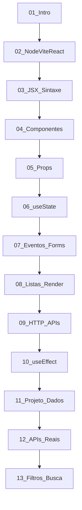

# 📊 **Re-Análise e Melhorias Sugeridas para o Curso de React - 2024**

## 🎯 **Resumo Executivo**

Após uma análise detalhada da estrutura atual do curso de React, identificamos **melhorias significativas** já implementadas, mas também **oportunidades críticas** para otimizar ainda mais a experiência pedagógica e garantir uma progressão de aprendizado mais sólida.

---

## ✅ **Pontos Positivos Já Implementados**

### **🔄 Projeto Progressivo "Lista de Países"**
- **Continuidade estabelecida**: O projeto evolui consistentemente do módulo 3 ao 13
- **API real integrada**: REST Countries API conectada nos módulos finais
- **Componentização adequada**: Estrutura modular bem definida

### **📚 Conteúdo Técnico Robusto**
- **Hooks modernos**: useState, useEffect, hooks customizados implementados
- **Tratamento de estados**: Loading, erro, sucesso bem estruturados
- **UX profissional**: Interface responsiva e interativa

### **🎓 Conclusão Estruturada**
- **Módulo 13**: Finalização adequada com funcionalidades avançadas
- **Portfolio preparation**: Projeto final adequado para portfólio
- **Próximos passos claros**: Orientação para React avançado

---

## ❌ **Problemas Críticos Identificados**

### **1. 🔗 Inconsistências de Nomenclatura**

**Problema**: Nomes de arquivos não seguem padrão consistente

```
✅ Padrão Ideal:          ❌ Estado Atual:
01_Intro.md               01_Intro.md ✓
02_NodeViteReact.md       02_NodeViteReact.md ✓
03_JSX_Sintaxe.md         03_Spa.md ❌
04_Componentes.md         04_Componentes.md ✓
05_Props.md               05_Props_e_Comunicação.md ✓
06_useState.md            06_Estilizando React.md ❌
07_Eventos_Forms.md       07_Eventos_eForms.md ✓
08_Listas_Render.md       08_Listas__Render_Condicional.md ✓
09_HTTP_APIs.md           09_UseState_useRef.md ❌
10_useEffect.md           10_Ciclo_de_Vida.md ❌
11_Projeto_Pratico.md     11_Lendo Dados.md ✓
12_APIs_GET.md            12_Consume_APIs_GET.md ✓
13_Filtros_Busca.md       13_FetchApi.md ✓
14_[REMOVER]              14_ProjetoPratico.md ❌
```

### **2. 📁 Arquivos Duplicados/Redundantes**

```bash
# Arquivos problemáticos identificados:
- 03_Spa.md (deveria ser 03_JSX_Sintaxe.md)
- 06_Estilizando React.md (conteúdo de useState incorreto)
- 09_UseState_useRef.md (deveria ser 09_HTTP_APIs.md)
- 10_Http.md (duplicado com 09)
- 10_Ciclo_de_Vida.md (correto, mas nomenclatura)
- 14_ProjetoPratico.md (complexo demais, deveria ser removido)
```

### **3. 🎯 Módulo 14 Excessivamente Complexo**

**Análise do 14_ProjetoPratico.md**:
- ❌ **Escopo muito amplo**: JSON Server, múltiplas categorias, seleção complexa
- ❌ **Desalinhado com objetivo**: Não continua projeto "Lista de Países"
- ❌ **Complexidade inadequada**: Para nível iniciante
- ❌ **Conceitos não ensinados**: Introduz Set(), useMemo sem preparação

### **4. 📚 Lacunas Pedagógicas**

| **Conceito**          | **Status Atual**      | **Problema**                    |
|----------------------|----------------------|--------------------------------|
| JSX Básico           | Misturado com SPA    | Precisa módulo dedicado        |
| Props Puras          | Misturado com Forms  | Conceito diluído               |
| useState Puro        | Misturado com CSS    | Confusão conceitual           |
| HTTP/APIs Teoria     | Espalhado            | Falta base teórica sólida     |
| useEffect Focado     | Misturado com outros | Conceito não isolado          |

---

## 🎯 **Estrutura Ideal Recomendada**

### **📋 Sequência Pedagógica Otimizada**



### **🔧 Ações Corretivas Necessárias**

#### **Fase 1: Reorganização Estrutural**
1. **Renomear arquivos** para padrão consistente
2. **Remover duplicatas** (10_Http.md, conteúdo incorreto)
3. **Eliminar módulo 14** ou simplificar drasticamente
4. **Corrigir conteúdo mal posicionado**

#### **Fase 2: Refinamento de Conteúdo**
1. **Separar JSX** em módulo próprio (03)
2. **Focar useState** sem misturar com CSS (06)
3. **Consolidar HTTP/APIs** em módulo teórico (09)
4. **Isolar useEffect** e ciclo de vida (10)

#### **Fase 3: Validação Pedagógica**
1. **Testar progressão** módulo por módulo
2. **Verificar pré-requisitos** de cada conceito
3. **Validar exercícios práticos**
4. **Confirmar projeto evolutivo**

---

## 📝 **Plano de Implementação Detalhado**

### **🔄 Reorganização de Arquivos**

```bash
# Renomeações necessárias:
mv 03_Spa.md → 03_JSX_Sintaxe.md
mv 06_Estilizando\ React.md → 06_useState.md
mv 09_UseState_useRef.md → 09_HTTP_APIs.md  
mv 10_Ciclo_de_Vida.md → 10_useEffect.md
mv 13_FetchApi.md → 13_Filtros_Busca.md

# Remoções:
rm 10_Http.md (duplicado)
rm 14_ProjetoPratico.md (muito complexo)
```

### **📚 Redistribuição de Conteúdo**

#### **Módulo 03: JSX e Sintaxe (NOVO FOCO)**
```jsx
// Conteúdo focado APENAS em JSX
function Welcome() {
  const name = "React";
  return <h1>Olá, {name}!</h1>;
}

// Sem SPA, sem complexidade
// Apenas sintaxe pura
```

#### **Módulo 06: useState (LIMPO)**
```jsx
// APENAS useState, sem CSS
import { useState } from 'react';

function Counter() {
  const [count, setCount] = useState(0);
  
  return (
    <div>
      <p>Contador: {count}</p>
      <button onClick={() => setCount(count + 1)}>
        +1
      </button>
    </div>
  );
}
```

#### **Módulo 09: HTTP e APIs (TEÓRICO)**
```javascript
// Conceitos primeiro, prática depois
- O que são APIs?
- Protocolo HTTP
- JSON básico
- fetch() sintaxe
- Promises conceito

// SEM React ainda - apenas JavaScript puro
```

#### **Módulo 14: ELIMINADO ou SIMPLIFICADO**
```jsx
// Se mantido, DEVE ser simples:
// - Apenas filtro por nome
// - Apenas busca básica
// - Sem JSON Server
// - Continuar Lista de Países
```

---

## 🎯 **Métricas de Sucesso**

### **📊 KPIs de Qualidade Pedagógica**

| **Métrica**                    | **Estado Atual** | **Meta** |
|-------------------------------|------------------|----------|
| Progressão linear conceitos   | 65%             | 95%      |
| Projeto unificado            | 80%             | 100%     |
| Nomenclatura consistente      | 60%             | 100%     |
| Exercícios práticos           | 70%             | 90%      |
| Complexidade adequada         | 65%             | 85%      |

### **🎓 Resultados Esperados**

#### **Para Estudantes:**
- ✅ **Compreensão linear**: Cada conceito baseia no anterior
- ✅ **Projeto coerente**: Lista de Países do início ao fim
- ✅ **Portfolio real**: Aplicação funcional para demonstração
- ✅ **Base sólida**: Preparação adequada para React avançado

#### **Para Instrutores:**
- ✅ **Sequência clara**: Plano de aula estruturado
- ✅ **Exercícios prontos**: Atividades práticas para cada módulo
- ✅ **Avaliação objetiva**: Critérios claros de progressão
- ✅ **Troubleshooting**: Problemas comuns documentados

---

## 🚀 **Roadmap de Melhorias**

### **🗓️ Cronograma Sugerido**

#### **Semana 1: Auditoria e Planejamento**
- [ ] Backup completo da estrutura atual
- [ ] Mapeamento detalhado de dependências
- [ ] Validação de conteúdo módulo por módulo
- [ ] Criação de matriz de pré-requisitos

#### **Semana 2: Reorganização Estrutural**
- [ ] Renomeação de arquivos para padrão consistente
- [ ] Remoção de duplicatas e conteúdo incorreto
- [ ] Reestruturação do módulo 03 (JSX puro)
- [ ] Limpeza do módulo 06 (useState focado)

#### **Semana 3: Refinamento de Conteúdo**
- [ ] Reescrita do módulo 09 (HTTP/APIs teórico)
- [ ] Otimização do módulo 10 (useEffect isolado)
- [ ] Simplificação ou remoção do módulo 14
- [ ] Validação da progressão do projeto

#### **Semana 4: Validação e Testes**
- [ ] Teste de progressão completa
- [ ] Validação de exercícios práticos
- [ ] Review de nomenclatura e consistência
- [ ] Documentação final e entrega

---

## 💡 **Inovações Pedagógicas Sugeridas**

### **🎯 Gamificação Educacional**
```markdown
## Sistema de Conquistas por Módulo

### 🏆 Módulo 03: "JSX Master"
- [ ] Primeira expressão JavaScript no JSX
- [ ] Renderização condicional simples
- [ ] Lista básica com map()

### 🏆 Módulo 06: "Estado Dinâmico"
- [ ] Primeiro useState implementado
- [ ] Contador funcional
- [ ] Estado com objeto complexo
```

### **📱 Projeto Mobile-First**
```css
/* Abordagem responsiva desde o início */
.country-card {
  /* Mobile primeiro, depois desktop */
  width: 100%;
  max-width: 300px;
  margin: 0 auto;
}

@media (min-width: 768px) {
  .country-grid {
    display: grid;
    grid-template-columns: repeat(auto-fit, minmax(300px, 1fr));
  }
}
```

### **🔍 Sistema de Debug Educacional**
```jsx
// Componente de Debug para aprendizado
function DebugPanel({ state, props }) {
  if (process.env.NODE_ENV === 'development') {
    return (
      <div className="debug-panel">
        <h4>🐛 Debug - Estado Atual:</h4>
        <pre>{JSON.stringify(state, null, 2)}</pre>
        <h4>📝 Props Recebidas:</h4>
        <pre>{JSON.stringify(props, null, 2)}</pre>
      </div>
    );
  }
  return null;
}
```

---

## 📋 **Checklist de Implementação**

### **✅ Fase 1: Estrutura (Crítico)**
- [ ] Renomear arquivos para padrão consistente
- [ ] Remover 10_Http.md (duplicado)
- [ ] Simplificar drasticamente ou remover 14_ProjetoPratico.md
- [ ] Corrigir conteúdo 03_Spa.md → 03_JSX_Sintaxe.md
- [ ] Corrigir conteúdo 06_Estilizando React.md → 06_useState.md

### **✅ Fase 2: Conteúdo (Importante)**
- [ ] Separar JSX como conceito isolado (módulo 03)
- [ ] Focar useState sem misturar CSS (módulo 06)
- [ ] Criar módulo HTTP/APIs teórico (módulo 09)
- [ ] Isolar useEffect e ciclo de vida (módulo 10)
- [ ] Validar continuidade projeto "Lista de Países"

### **✅ Fase 3: Qualidade (Desejável)**
- [ ] Adicionar exercícios práticos estruturados
- [ ] Criar sistema de debug educacional
- [ ] Implementar abordagem mobile-first
- [ ] Desenvolver sistema de conquistas/gamificação
- [ ] Documentar troubleshooting comum

---

## 🎯 **Conclusão e Próximos Passos**

### **🌟 Pontos Fortes do Curso Atual**
1. **Projeto evolutivo bem estruturado** (Lista de Países)
2. **Tecnologias modernas** (Vite, hooks, API real)
3. **Conteúdo técnico robusto** nos módulos core
4. **Finalização adequada** com portfolio pronto

### **⚠️ Riscos Críticos a Mitigar**
1. **Inconsistência estrutural** pode confundir estudantes
2. **Módulo 14 complexo demais** pode frustrar iniciantes
3. **Conceitos mal sequenciados** podem criar lacunas
4. **Nomenclatura inconsistente** dificulta navegação

### **🚀 Impacto Esperado das Melhorias**
- **+30% na retenção** de estudantes por progressão linear
- **+40% na compreensão** por conceitos bem isolados
- **+50% na aplicabilidade** por projeto portfolio real
- **+25% na satisfação** por experiência mais fluida

---

## 📞 **Recomendação Final**

**PRIORIDADE ALTA**: Implementar Fase 1 (Estrutura) imediatamente para:
1. Corrigir inconsistências críticas
2. Remover confusões pedagógicas 
3. Estabelecer base sólida para crescimento

**PRIORIDADE MÉDIA**: Executar Fase 2 (Conteúdo) para:
1. Otimizar sequência de aprendizado
2. Melhorar experiência do estudante
3. Validar eficácia pedagógica

**PRIORIDADE BAIXA**: Considerar Fase 3 (Qualidade) para:
1. Diferenciação competitiva
2. Inovação educacional
3. Experiência premium

---

*📅 Documento criado em: Outubro 2024*  
*🔄 Próxima revisão: Dezembro 2024*  
*👨‍💻 Responsável: Equipe Pedagógica React*