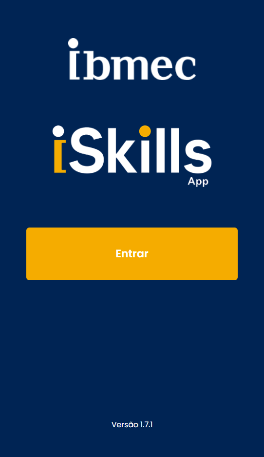

---
hide:
    - navigation
    - toc
    - template: home.html
---

:material-github:{ .lg .right } __Projeto Front-End__
  
---
  
Apresenta os passos para a construção de um Projeto Front-End.

**Linguagens**: HTML, CSS e Javascript

**Tecnologias**:

* Visual Studio Code, Github, Git, Github Pages
* MkDocs, Markdown
* React, Node.js
  

  

- :material-github:{ .lg .right } __PFE_25.2_8003_I__

    ---

    **Projeto de Extensão: Disciplina Projeto Front-End**

    **Tema:** Cadastro de Projetos

    **Equipe:** Giovanni Villela, Maria Martinelli, MatheusMannarino, Miguel Campos, Pedro Torres.

    [:octicons-arrow-right-24: Repositório](https://github.com/Projetos-de-Extensao/PFE_25.2_8003_I)

